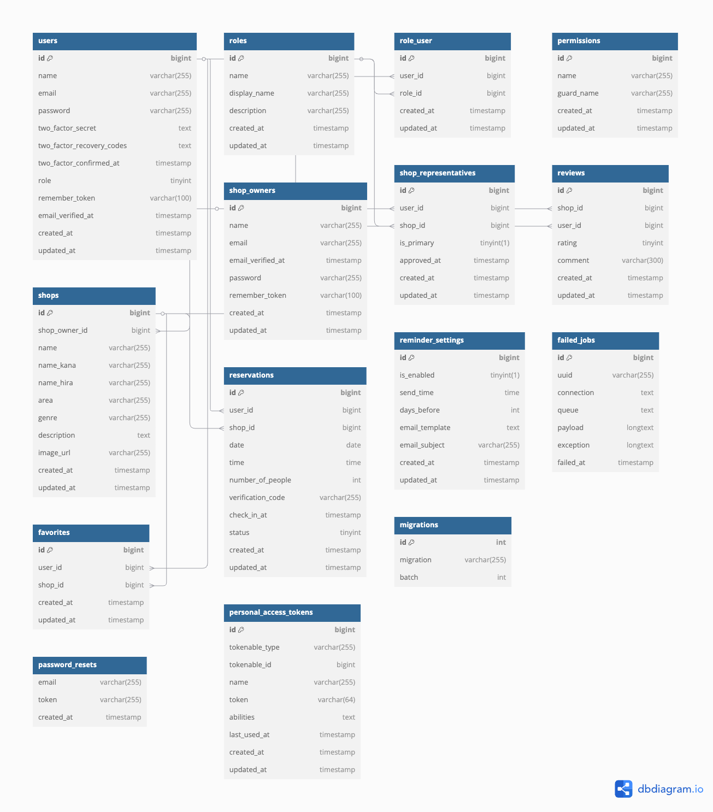

## Rese（リーズ）

### 📝 概要

Reseは企業のグループ会社向けに開発された飲食店予約サービスです。外部の飲食店予約サービスでは手数料が発生するため、自社でサービスを構築・運営することでコスト削減を実現します。

### 🌟 主な特徴

・グループ会社専用の飲食店予約システム

・手数料なしで予約可能

・シンプルで使いやすいインターフェース

・初年度ユーザー数10,000人を目標

### 🔧 使用技術

バックエンド
・PHP

・Laravel（認証にはFortifyを使用）

・MySQL

フロントエンド

・レスポンシブデザイン（ブレイクポイント768px）

・タブレット・スマートフォン対応

インフラ・開発環境

・GitHub（バージョン管理）

## 💻 データベース設計

以下はプロジェクトのER図です：

## 📋 機能一覧

### ✅ 実装済み機能

#### ユーザー機能

・会員登録（Fortifyを使用）

・ログイン

・ログアウト

・ユーザー情報取得

・ユーザー飲食店お気に入り一覧取得
https://drive.google.com/file/d/1f8FRKSwM3UhVCov3onZR6ZW18fmOVMK-/view?usp=drive_link（ログイン後1）

https://drive.google.com/file/d/14k-vTnC0lKjFWNkdFgEBTBuj_vg4CsGp/view?usp=drive_link（ログイン後2）

・ユーザー飲食店予約情報取得
・飲食店一覧取得
https://drive.google.com/file/d/11rki8B5HJcTR71bMigDEu64TnaWD9vdN/view?usp=drive_link（Home）

・飲食店詳細取得

・飲食店お気に入り追加
・飲食店お気に入り削除
https://drive.google.com/file/d/1FCcEhq2-OYS--Hu17iN6fZqOhOdnO5oi/view?usp=drive_link（ログイン後1）

https://drive.google.com/file/d/14k-vTnC0lKjFWNkdFgEBTBuj_vg4CsGp/view?usp=drive_link（ログイン後2）

・飲食店予約情報追加
https://drive.google.com/file/d/16T0AHsahi6Z7e8PjHQmT2TPQKdvomSTA/view?usp=drive_link（予約機能1）

https://drive.google.com/file/d/1rgCWWM9F2kPapy0_T6OZa7j8S6C2a_9B/view?usp=drive_link（予約機能2）

・飲食店予約情報削除

・エリアで検索する
・ジャンルで検索する
・店名で検索する
https://drive.google.com/file/d/1Tbryw1hcVKk2ZUV4-1Qddz8vM4HPGKc3/view?usp=drive_link（検索1）

https://drive.google.com/file/d/1Rra1JLPpgMPE8J-8Kbpk6wFqX-gAH7uL/view?usp=drive_link（検索2）

https://drive.google.com/file/d/1z4opYDTCtw4ulqH9EHI-tTppWibdVJwS/view?usp=drive_link（検索3）

#### 予約関連機能

・予約したお店に来店した後に、利用者が店舗を5段階評価とコメントができるようにする（評価機能）
https://drive.google.com/file/d/1LeDwwYSPVr6eUUGWZPmOPY-uMiwuT9Pm/view?usp=drive_link（評価機能）

・マイページの予約状況から「予約日」「時間」「人数」の変更が可能
https://drive.google.com/file/d/12awSXsY1uBgxEb0iHpAPy-twAbxb81H9/view?usp=drive_link（予約変更）

・マイページの予約状況からORコードの発行が可能

#### 管理機能

・管理者向け管理画面（admin@example.com / password123 でログイン可能）

・ストレージへの保存

・お知らせメールの送信

・リマインダー送信

#### フロントエンド

・レスポンシブデザイン対応

#### 認証

・メールによって本人確認を行うことができる

#### その他

・モーダルウィンドウ機能
https://drive.google.com/file/d/15CrOrMXIGjE19ZrZdpaZGo-MqaHmizkb/view?usp=drive_link（モーダルウインドウ）

・決済機能
https://drive.google.com/file/d/1n-ouW7oThIfPONsbUA6qnLbhqEuDitPc/view?usp=drive_link（決済機能）

## 🎯 ターゲットユーザー

・20〜30代の社会人

・グループ企業に所属する従業員

## 💻 動作環境

・PC: Chrome/Firefox/Safari 最新バージョン

## 🚀 セットアップ手順

必要要件

・PHP（Laravelの動作要件を満たすバージョン）

・Composer

・Node.js & npm

・MySQL

## インストール手順

### 1.リポジトリのクローン

git clone https://github.com/sakura24999/Rese.git

cd Rese

### 2.環境変数の設定

cp .env.example .env

### 3.依存パッケージのインストール

composer install

npm install

### 4.アプリケーションキーの生成

php artisan key:generate

### 5.データベースのマイグレーション

php artisan migrate --seed

### 6.開発サーバーの起動

php artisan serve

### 7.Mailhogの確認方法

メール送信機能をテストする場合は、Mailhogを使用しています。

送信されたメールは以下のURLでアクセスして確認できます：

http://localhost:8025

